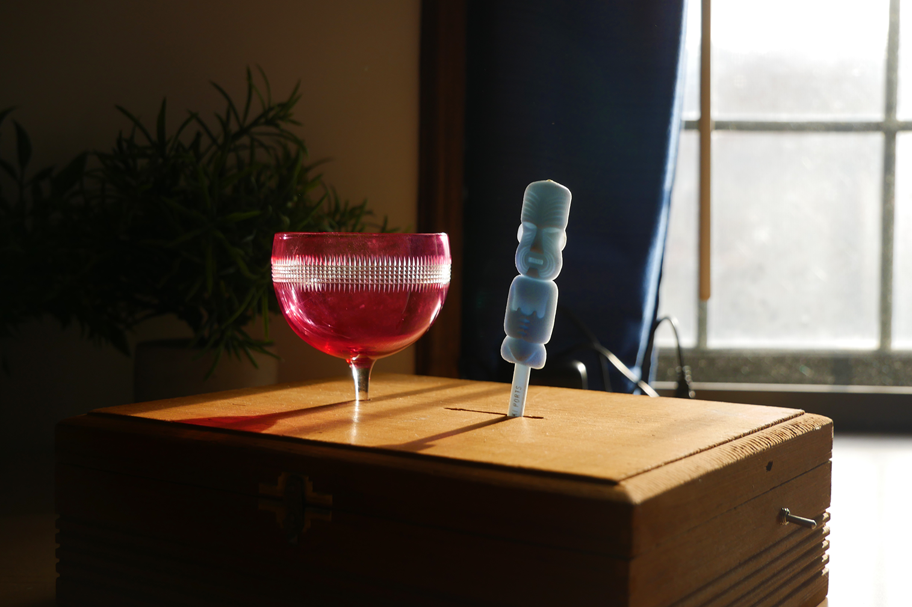

# CPSC 334 Assignment #4 - The 5 o'Clock

*The 5 o'Clock* is a vibey electro-acoustic alarm clock with a single purpose - to let you know when it's time to end the work day and unwind. Maybe sit down with a friend and watch the sunset with a cocktail in hand.

## Video demo

Check it out: [https://www.youtube.com/watch?v=dggmvMKxl2g](https://www.youtube.com/watch?v=dggmvMKxl2g)

## Components:

- 28BYJ-48 Step Motor
    - and ULN2003 Driver board
- MG90S Micro Servo Motor
- ESP32
- DC power supply for the driver board
- Switch

## Wiring diagram:

+-------+
|       |
|       |
|power  |
|source |                                             +-------+
|12v    |                                             |       |
+----^^-+                                             |       |
     ||                       +----------------++-----+ servo |
     ||                       |                ||     |       |
     ||      +----------------+------+-+-+-+   ||     +-------+
     ||      |                |      | | | |   ||
+----++------+-+              |      | | | |   ||
|              |          3.3v power | | | |   ||
| driver board |              |      | | | |   || ground
|              |           +--v------v-v-v-v---vv------+
+------+-------+           |         25-35    13       |
       |                   |                           |
       |                   |                           |
 +-----v-----+             |           ESP32           |
 |           |             |                           |
 |           |             |                           |
 |  stepper  |             |                           |
 |           |             |                           |
 |           |             +---------------------------+
 +-----------+

## How to run:

1. Connect components, upload `5oclock.ino` to ESP32. Power the ESP32 via USB and the driver board with the DC adapter.
2. Flick switch to start device
3. Flick again to stop!