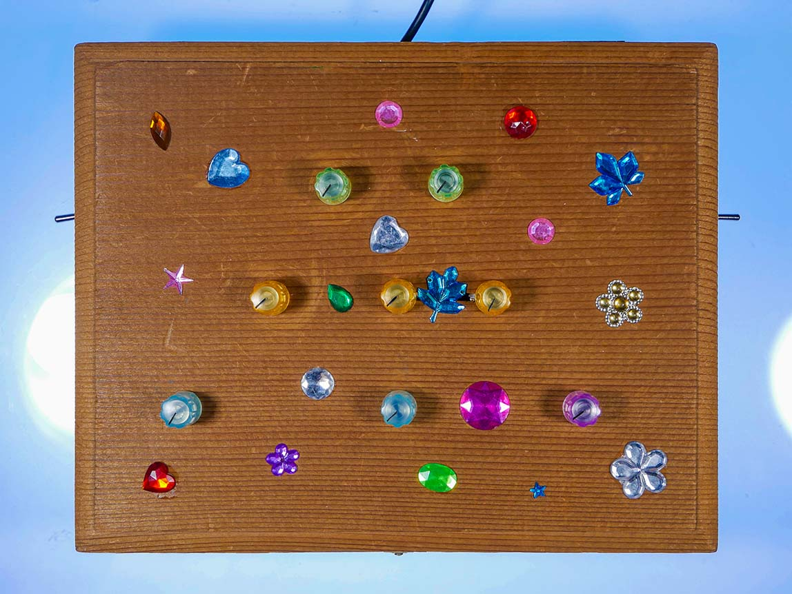

# CPSC 334 Final Assignment - Drum/Drama Machine

*The Drum/Drama Machine* is a wooden box full of wonders. Drum mode plays a randomly generated drum loop sequence (kick, snare + hi-hat). You can control the pattern and length of the loop using the blue knobs and edit the character of each individual sound using the yellow knobs. The two green knobs are echo and distortion effects. When you switch the machine into Drama mode, it turns into a chaotic drone generator. The kick becomes a tone, and the snare and hat turn into noise. All the controls remain the same, so you can edit the drone sequence and apply effects to it, just as you would in drum mode. You can play with the kick and echo knobs expressively to produce occasionally beautiful harmonies ✨

## Video demo

Check it out: ****

## Components:

- BeagleBone + Bela cape (https://bela.io/)
- 8x 1kΩ rotary potentiometers
- 2x switches

## Wiring:

Wire the middle pin of the potentiometers into the following Bela analog input slots:

0. Random seed
1. Step size
2. Echo
3. Distort
4. Kick sound
5. Snare sound
6. Hi-hat sound
7. Volume

Wire the left pin of each knob into power (3.3V) and the right pin into ground.

Connect the on/off switch to Digital 7 (PD 18) and the drum/drama control to Digital 10 (PD 21).

## How to run:

1. Connect components. Rename `drum-drama-machine.pd` to `_main.pd` and upload to Bela by dragging it into the IDE. Power the Bela via USB.
2. Connect 3.5mm to audio output
3. Flick switch to start device.